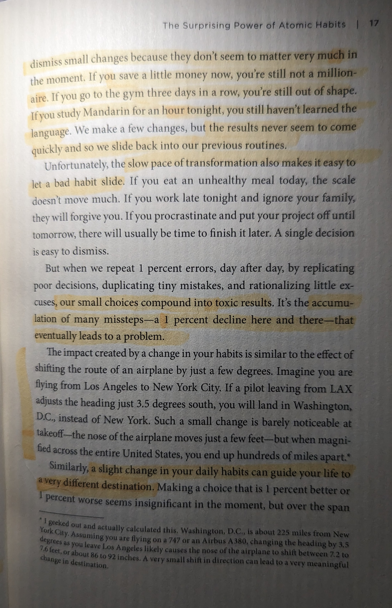

In high school, I somewhat started my journey for depth through reading. One of the first books i found engaging on a psychological level was James Clear's *Atomic Habits*. As an individual struggling with forming better habits and abandoning poor ones, I took a lot out of this book. While I do not have the copy on me currently, I in fact annotated the hell out of it. I wrote in in with pen, I highlighted in it, I sticky-noted sections to come back to — all in an effort to maximize my return from this book.

While this was all happening on my own time, I had an esteemed teacher in high school. This teacher was a professor of Greco-Roman Humanities, as well as teaching a deeper class on religion, culture, and worldviews of the East. I maintain to have a lot of respect for him; however, some advice upon showing him my copy of *Atomic Habits* was one I will never forget:

> **Never annotate more than 20% of a book.**

This stuck with me, ticking in my brain like a metronome. Have I been reading *wrong*? I felt at a standstill, unable to continue my reading because of what I suspected were poor practices. I took it with a grain of salt, and made my own way through.

Fast forward to today, I LOVE to annotate my books. Not in the typical annotate for learning way, but whatever stands out to. While fiction and non-fiction differ, I have learned that I focus better on what I'm reading if I am actually taking notes in the margins, writing up the text, or even analyzing the issues at hand. I, in fact, wrote all over my physical copy of my Calculus book. This, too, was the best way for me to practice the problems at hand.

Additionally Ryan Holiday, author of *The Daily Stoic* and owner of The Painted Porch Bookshop, notes that the best way to honor an author is to write in your books. Reflect in them, note your thoughts, create new ideas. Watch [this video](https://www.youtube.com/watch?v=VA6kJoUEqPY) for a few more tips.

While often highlighting and writing in books can be a necessary endeavor, it is one which allows you to intertwine your ideas with that of another. Highlight your favorite quotes, destroy the books, honor the author. To annotate is to embroider.
